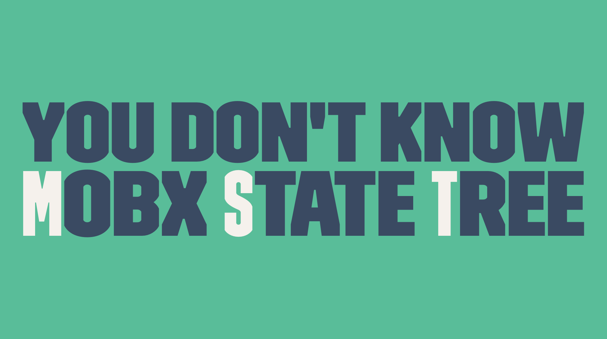

# You don't know Mobx State Tree
Slides of the talk "You don't know Mobx State Tree"

- [International Javascript Conference](https://javascript-conference.com/) (London 11/04/2018)
- [TechFest 2018](https://2018.techfest.ro/bucharest/) (Bucharest 24/09/2018)
- Codemotion Berlin 2018 (Berlin 21/11/2018)
- Codemotion Milan 2018 (Milan 29/11/2018)

## Tools
What I used for these slides

- Slides [Deckset](https://www.decksetapp.com/)
- Draws [draw.io](https://www.draw.io)
- Code Examples [Carbon](https://github.com/dawnlabs/carbon)
