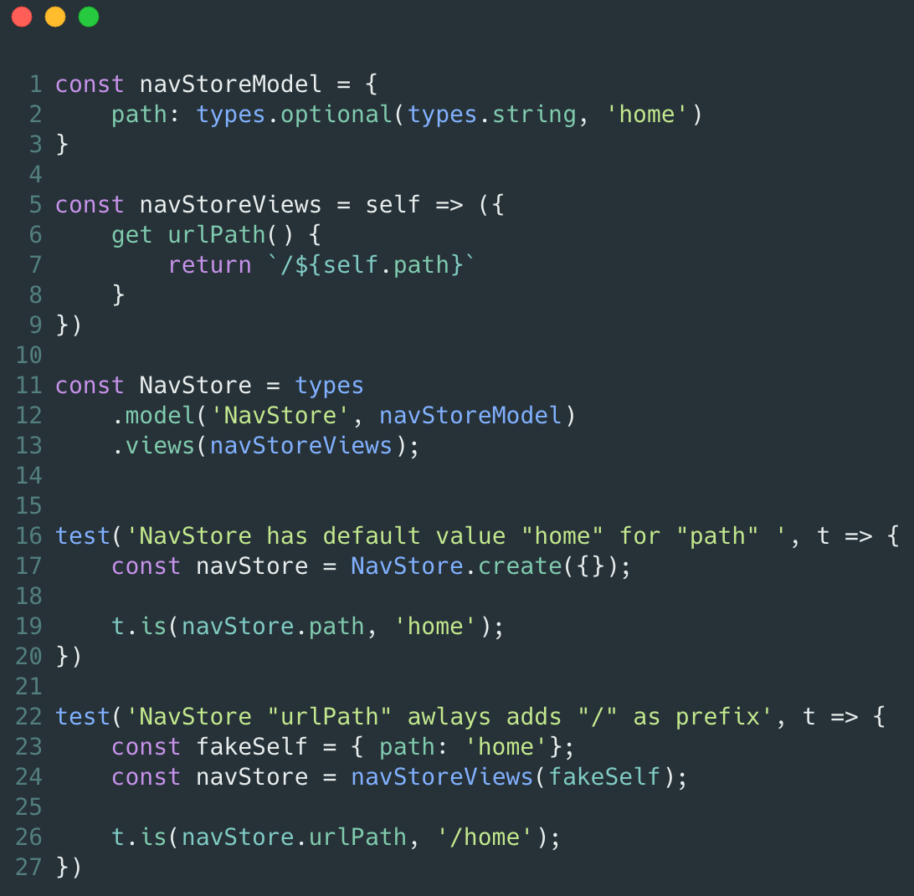
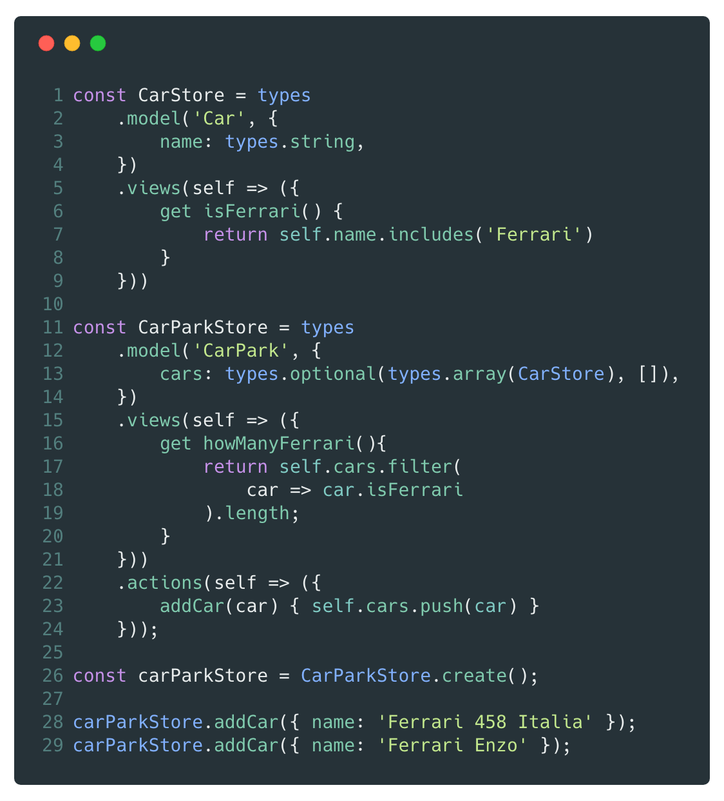
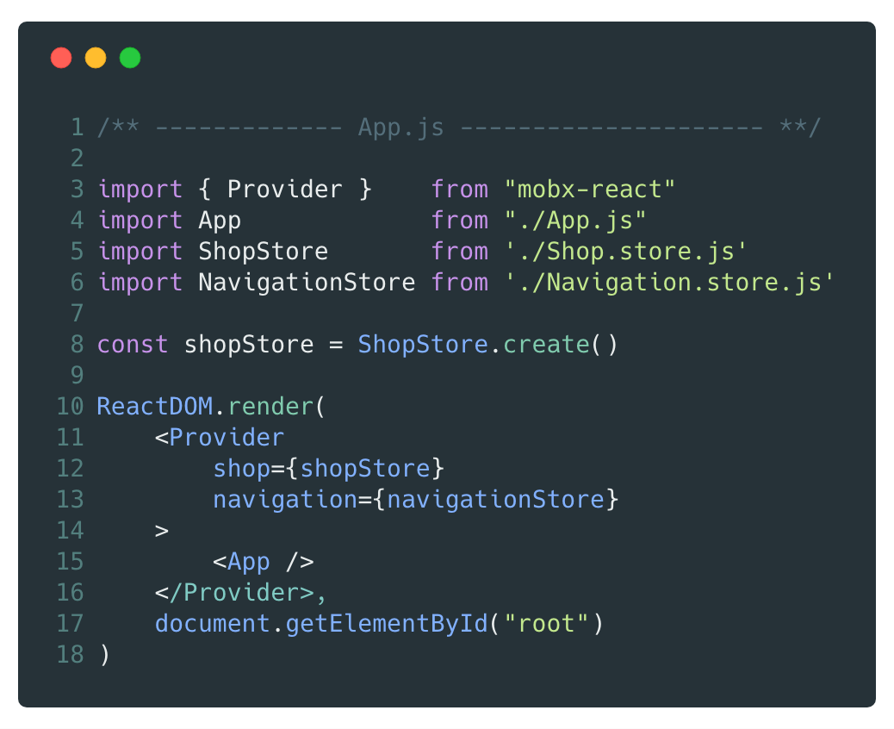
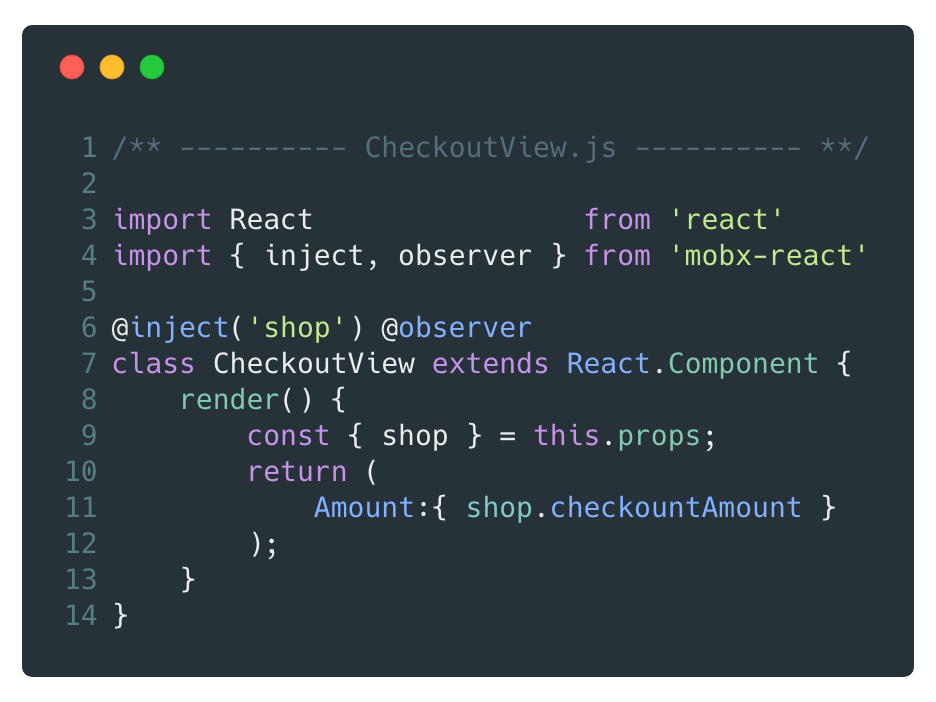
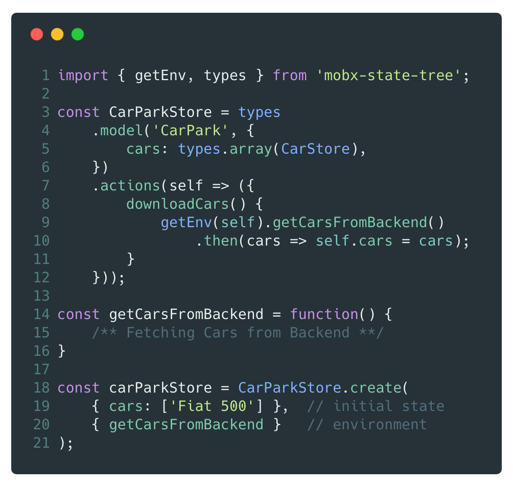
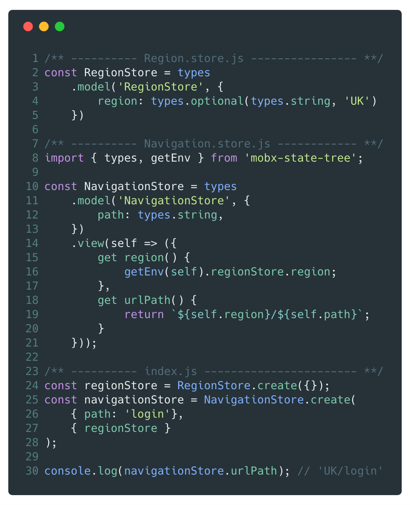

# [fit]You Don't know
# [fit]__*M*__obX __*S*__tate __*T*__ree

Milan _|_ 29-30 November 2018

Max Gallo _|_ @_maxgallo


[.footer: ]

---


# Hi 👋🏻
## [fit]I'm Max Gallo

About me:🍝 💻 🇬🇧 🎶 🏍 📷 ✈️ ✍️

Principal Engineer @ DAZN
<br />


_twitter:_ @\_maxgallo
_more:_ maxgallo.io

---

# [fit] Agenda 
[.build-lists: true]

<br />

- _Part One:_ MobX
- _Part Two:_ MobX State Tree
- _Part Three:_ Designing a Reactive Project

---


# Part One
## _**MobX**_

---

# [fit]MobX

[.build-lists: true]
- State Management Library
- Helps decoupling View from Business Logic
- Reactive Programming
- Flexible / Unopinionated

---

# MobX _**Observables & reactions**_
^ It's "Transparent" since we don't have manual subscription

[.code-highlight: 1-6]
[.code-highlight: 1-9]
[.code-highlight: 8-13]
[.code-highlight: 1-13]

```javascript
import { observable, autorun} from 'mobx';

const album = observable({
	title: 'Californication',
	playCount: 0,
});

autorun(() => console.log(`New play count: ${album.playCount}`))
// New play count: 0

album.playCount = 1; // New play count: 1

album.playCount = 24; // New play count: 24
```

---
^ - Computed values are derivation of the state
- Computed values are observable
- Computed values are lazily evaluated, only if observed

# MobX _**Computed Values**_

[.code-highlight: 1-6]
[.code-highlight: 8-9]
[.code-highlight: 8-11]
[.code-highlight: 8-15]
[.code-highlight: 1-15]

```javascript
import { observable, autorun, computed} from 'mobx';

const album = observable({
	title: 'Californication',
	playCount: 0,
});

const all = computed(() => album.title + album.playCount);

autorun(() => console.log(all))
// Californication0

album.playCount = 1;        // Californication1
album.title = 'OkComputer'; // OkComputer1
album.playCount = 24;       // OkComputer24 
```

---

#[fit] MobX _**Recap**_

_**Observable state**_
Mutable Application State

_**Computed Values**_
Automatically derived values, lazily evaluated

_**Reactions**_
Side effects like _autorun_ or updating a React component

---

# MobX ❤️ React

```javascript
const album = observable({
	title: 'Californication',
	playCount: 0,
});

@observable
class PlayCount extends React.Component {
	render() {
		return album.playCount;
	}
}

album.playCount++    // ----> React Render
album.playCount = 9  // ----> React Render
```
---


---


# Part Two
## _**MobX State Tree**_

---


# [fit] __*M*__obX __*S*__tate __*T*__ree

[.build-lists: true]

<br />

- Powered by _*MobX*_
- Runtime typed Application State
- Opinionated & ready to use
- Relies on the concept of Trees (Stores)

---
# What's a __*Tree*__/__*Store*__ ?

[.code-highlight: 1-7]
[.code-highlight: 8-12]
[.code-highlight: 1-12]
[.code-highlight: 14-18]
[.code-highlight: 1-18]

```javascript
import { types } from 'mobx-state-tree';

const AlbumStore = types
	.model('Album', {              // mobx observable
	    title: types.string,
	    rating: types.integer,
	})
	.views(self => ({
		get isGood() {              // mobx computed
			return self.rating >= 7
		}
	}));
	
const okComputer = AlbumStore.create(
	{ title: 'Ok Computer', rating: 8}
);

console.log(okComputer.isGood); // true
```


---
^ - Album inside Music Store
- Type casting of AlbumStore



#[fit] MobX State Tree _**Stores**_

_**Model**_

- Mutable observable state
- Runtime type information
- Could contain other trees

_**Views**_
MobX computed values

_**Actions**_
The only way to update the model

---

#### MobX State Tree

# How to connect
# [fit]__*the Stores*__
# with the View ?

---
^ - Inject everywhere
- Testing by overriding injections




---
### MobX State Tree __*Stores*__
# [fit] Deep Dive 🐙

- Mutable and Immutable (Snapshots, Time Travelling)
- Composition
- Lifecycle Methods
- Dependency Injection

---

^ Examples: Logger, API calls

### MobX State Tree __*Stores*__
# [fit] Dependency
# [fit] Injection



<br />

- Inject anything
- Environment is shared per tree
- Useful for testing

---


# Part Three
## _**Designing a reactive project**_

---

#[fit] Designing 🎨
# __*Stores*__

*1. Shape your Trees*
One Root Store vs Multiple Root Stores

*2. Stores Communication*
How Stores communicate between each other

---
### __*Shape your trees*__
# [fit] One Root Store


_Pros_ 👍

- Easier to perform actions on everything at once (snapshot, creation, destroy).
- Unique environment for dependency injection.

_Cons_ 👎
Very easy to create tightly coupled stores

---

### __*Shape your trees*__
# Multiple Root Stores


_Pros_ 👍
Easier to reason by Domain

_Cons_ 👎

- Less immediate to perform actions on everything
- Not single environment for dependency injection

---
## __*Real World*__
#[fit] Stores communication 📞

<br />

1. Default Approach

1. Actions Wrapper

1. Dependency Injection

---
### __*Stores Communication*__
#[fit] Default Approach
<br/>
<br/>

- Easier when using a Single Root Store
- Each Store could end up knowing the whole structure ⚠️


---
### __*Stores Communication*__
#[fit] Default Approach
```javascript
getParent().getParent().languageStore
```
<br/>

- Easier when using a Single Root Store
- Each Store could end up knowing the whole structure ⚠️


---
^ The action caller is unaware of what's going on behind the scene

### __*Stores Communication*__
#[fit] Actions Wrapper
One Store,
to rule them all 🧙‍♂️🌋💍
<br/>

- Calls directly other Stores
- Friendly interface
- Knows a lot about your App


---

### __*Stores Communication*__
#[fit] Actions Wrapper
One Store,
to rule them all 🧙‍♂️🌋💍
<br/>

- Calls directly other Stores
- Friendly interface
- Knows a lot about your App


---

### __*Stores Communication*__
#[fit] Actions Wrapper
One Store,
to rule them all 🧙‍♂️🌋💍
<br/>

- Calls directly other Stores
- Friendly interface
- Knows a lot about your App


---

### __*Stores Communication*__
#[fit] Actions Wrapper
One Store,
to rule them all 🧙‍♂️🌋💍
<br/>

- Calls directly other Stores
- Friendly interface
- Knows a lot about your App


---

### __*Stores Communication*__
#[fit] Dependency Injection
Injecting one or multiple stores into another one.
<br/>
 
- You could use it for both **Actions** and **Views**
- Circular dependencies while loading could be non-trivial




---

#[fit] One more thing ...


---

<br />

## [fit] __*Store*__
# [fit] Composition

```javascript
const BlueRectangleStore = types.compose(
	BlueStore,
	RectangleStore
);
```


---

^ - Mobile: Inertial Scrolling
- Desktop: Scrolling with arrows
- Renders only item in the view 

### __*Composition*__
# Real World Example 


---


<br />
<br />

### Composition
# [fit] Real World
# [fit] __*Example*__

---


# Conclusions
## _**Derive Everything**_

---

^ - Avoid manual subscription
  - Avoid undersubscribe or oversubscribe

> _Anything that **can be derived** from the application state, **should be derived**. Automatically_
--- Michel Weststrate

---


#[fit] Takeaways 🖇

- *MobX* opens the doors of _Reactive Programming_
- *MobX State Tree* provides a structure 
- Shape your tree & setup the communication
- Embrace *Composition*!
- Embrace *Reactivity*!

---

#[fit] Thanks 

<br />

🤓 github.com/maxgallo/you-dont-know-mobx-state-tree
✉️ hello@maxgallo.io
_twitter_ @\_maxgallo
_web_ maxgallo.io

[.footer: ]
