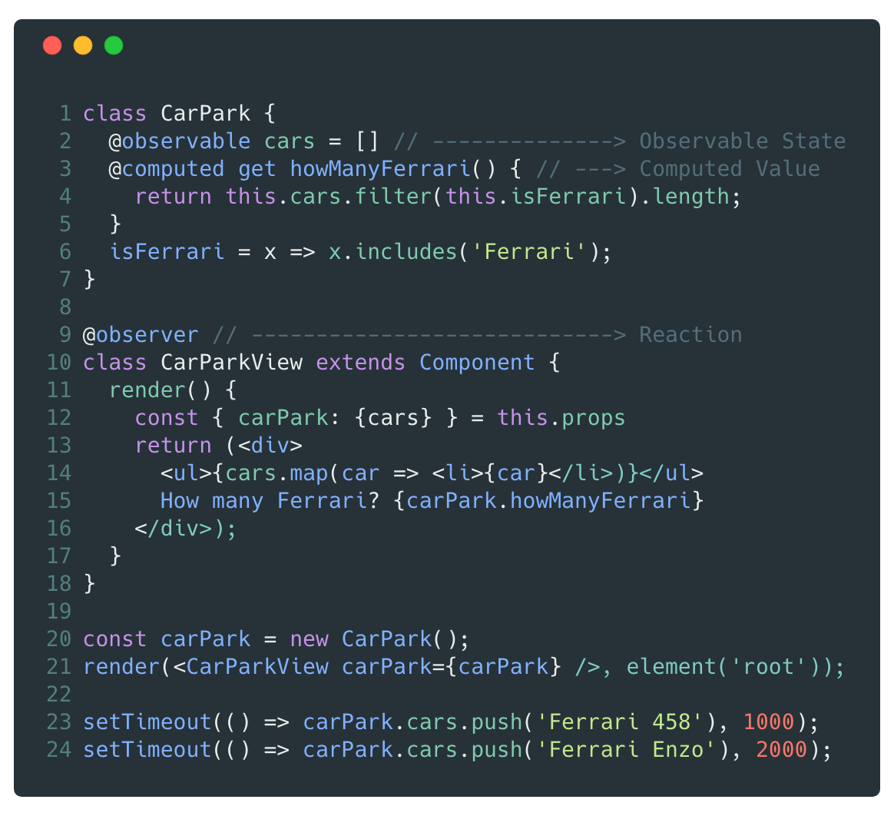
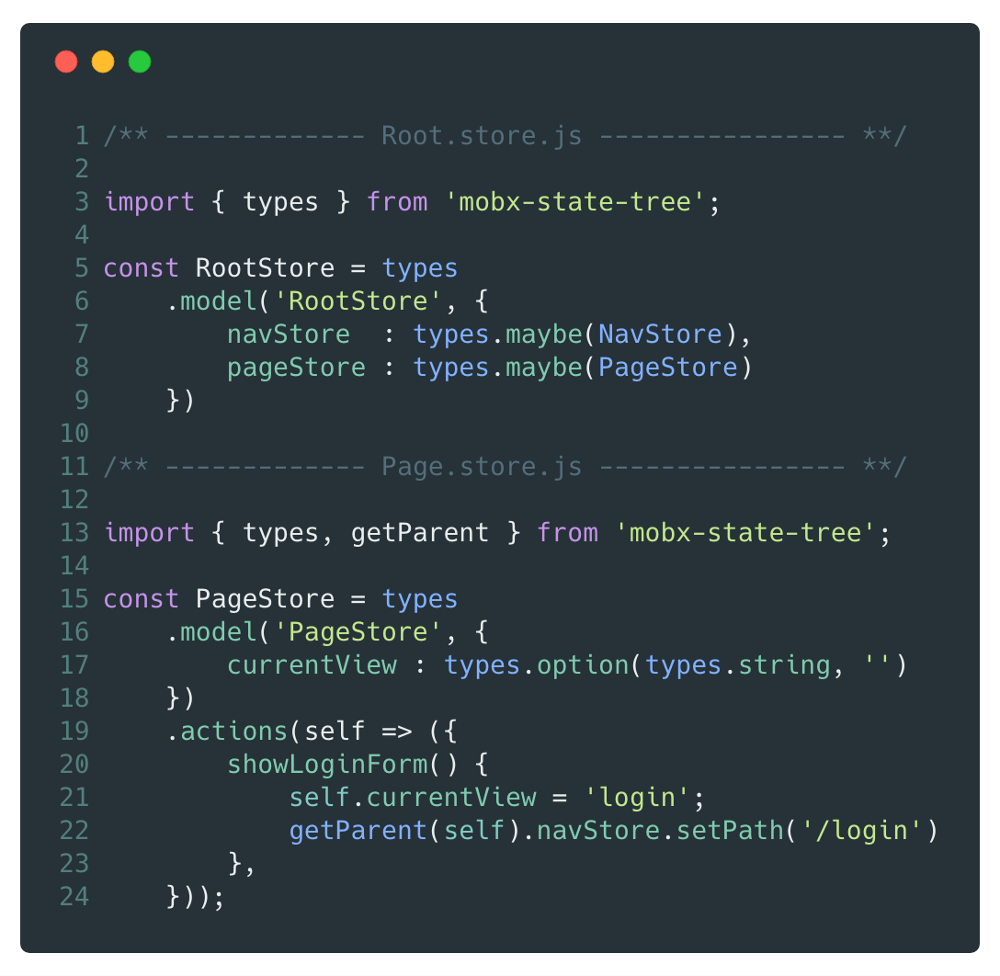
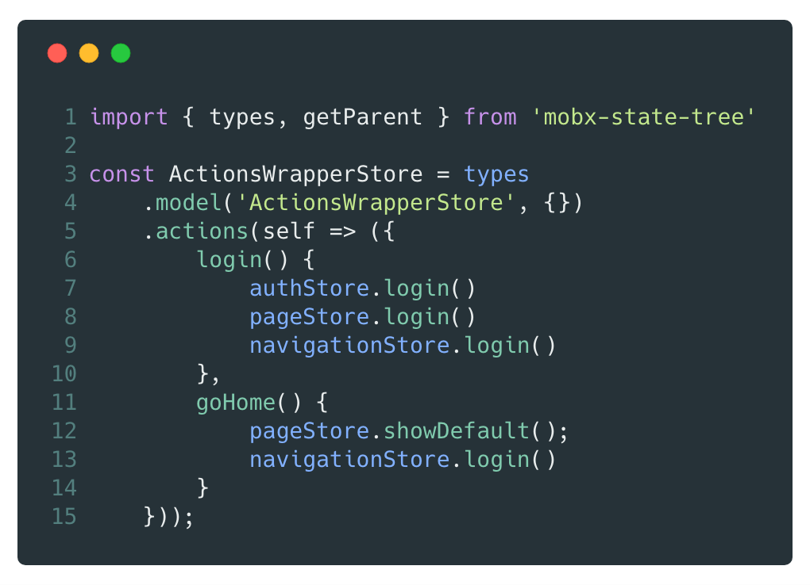

# [fit]You Don't know
# [fit]_**M**_obX _**S**_tate _**T**_ree

---
^Re-building DAZN 2.0 Front End

# Hi 👋🏻
## [fit]I'm Max Gallo
# Principal Engineer at __*DAZN*__

_twitter:_ @\_maxgallo (yes with an underscore)
_more:_ maxgallo.io

--- 

# [fit] The plan

- _MobX_ intro
- _MobX State Tree_ overview
- Designing a Reactive Project
- Best Practises

---

^ MobX State Tree is powered by MobX

# [fit] If _**MobX**_ is the Engine
# [fit]_**MobX State Tree**_ is the Car

---

# [fit]MobX
# [fit]The __*engine*__ of the car

- Decouples View from Business Logic
- Uses Reactive paradigms
- Unopinionated

---
^ - Observables, Computed Values, Observer, Reaction
#[fit] MobX _**Pillars**_

_**Observable state**_
Mutable Application State

_**Computed Values**_
Automatically derived values

_**@Observer**_
Subscribing to observables

_**Reactions**_
Side effects like updating a React component

---

^ - Application State updates after render
  - Non Decorator syntax available

# MobX

_**Observable state**_
Mutable Application State

_**Computed Values**_
Automatically derived values

_**@Observer**_
Subscribing to observables

_**Reactions**_
Side effects like updating a React component

---

# [fit] __*M*__obX __*S*__tate __*T*__ree

- Opinionated / Ready to use
- Powered by _*MobX*_
- Relies on the concept of Trees (Stores)

---
^ - Car inside Car Park
- Create an instance with `.create`

# What's a Tree ?
### also known as __*Store*__

_**Model**_

- Mutable observable state
- Contains type information
- Could contain other trees

_**Views**_
MobX computed values

_**Actions**_
The only way to update the model

---

### MobX State Tree

# How to connect __*Stores*__ with React components ?

---
^ - Inject everywhere
- Testing by overriding injections

---
### MobX State Tree __*Stores*__
# [fit] Deep Dive 🐙

- Mutable and Immutable (Snapshots, Time Travelling)
- Composition
- Lifecycle Methods
- Dependency Injection

---

^ Examples: Logger, API calls 

### MobX State Tree __*Stores*__
# [fit] Dependency
# [fit] Injection

 

- Inject anything
- Environment is shared per tree
- Useful for testing

---

#[fit] Designing 🎨
# __*Stores*__

*1. Shape your Trees*
One Root Store vs Multiple Root Stores

*2. Stores Communication*
How Stores communicate between each other

---
### __*Shape your trees*__
# [fit] One Root Store

_Pros_

- Easier to perform actions on everything at once (snapshot, creation, destroy).
- Unique environment for dependency injection.

_Cons_
Very easy to create tightly coupled stores

---

### __*Shape your trees*__
# Multiple Root Stores

_Pros_
Easier to reason by Domain

_Cons_

- Less immediate to perform actions on everything
- Not single environment for dependency injection

---
## __*Real World*__
#[fit] Stores communication 📞

1. Default Approach

1. Actions Wrapper

1. Dependency Injection

---
### __*Stores Communication*__
#[fit] Default Approach
Each Store access directly other Stores.
 

- Easier when using a Single Root Store
- Each Store could end up knowing the whole structure ⚠️

---
^ The action caller is unaware of what's going on behind the scene

### __*Stores Communication*__
#[fit] Actions Wrapper
One Store,
to rule them all 🧙‍♂️🌋💍
 

- Calls directly other Stores
- Knows a lot about your App

---

### __*Stores Communication*__
#[fit] Dependency Injection
Injecting one or multiple stores into another one.
 
 
- You could use it for both **Actions** and **Views**
- Carefull about circular dependencies

---

#[fit] One more thing ...

---

## __*Store*__
# Composition
Two or more stores can be composed

 

- Separation of Concerns
- Reusability

---

^ - Mobile: Inertial Scrolling
- Desktop: Scrolling with arrows
- Renders only item in the view 

### __*Composition*__
# Real World Example 

---

### Composition
# Real World Example 

**Data Store**
Holds the data to render

**Inertial/Arrow Scrolling**
Manages scrolling

**Element Pooling Store**
Renders only in view

---
^ - Avoid manual subscription

## Mindset 🧠
#[fit] Derive everything
 

When you add a new property in the Model,
ask yourself: _Can I derive it somehow ?_

 
> Anything that can be derived from the application state, should be derived. Automatically

---

#[fit] Takeaways

- MobX helps you decoupling your code
- MobX State Tree provides a structure 
- Shape your tree & setup the communication
- Embrace Composition!
- Embrace Reactivity!

---

#[fit] Thanks 

 

🤓 github.com/maxgallo/you-dont-know-mobx-state-tree
✉️ hello@maxgallo.io
_twitter_ @_maxgallo