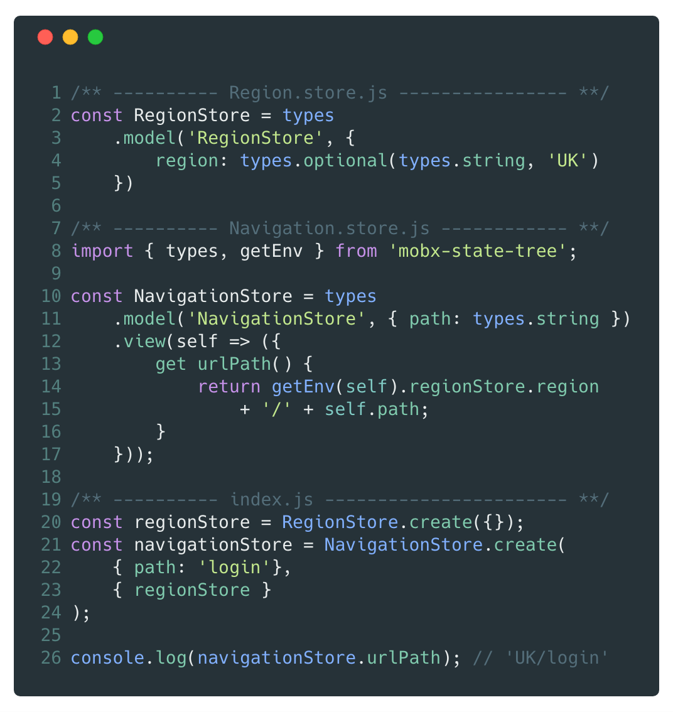

# [fit]You Don't know
# [fit]_**M**_obX _**S**_tate _**T**_ree

---

# Hi 👋🏻
## [fit]I'm Max Gallo
# Principal Engineer at __*DAZN*__

_twitter:_ @\_maxgallo (yes with an underscore)
_!twitter:_ maxgallo.io

--- 

# [fit] The plan

- _MobX_ intro
- _MobX State Tree_ overview
- Design a Reactive Project
- Best Practises

---

# [fit] If _**MobX**_ is the Engine
# [fit]_**MobX State Tree**_ is the Car

---

# [fit]MobX
# [fit]The __*engine*__ of the car

- Uses Reactive paradigms
- Decouples view from business logic

---

# MobX

_**Observable state**_
Mutable Application State

_**Computed Values**_
Automatically derived values

_**@Observer**_
Subscribe to every observable in the render function

_**Reactions**_
Side effects like updating a React component

---

# [fit] __*M*__obX __*S*__tate __*T*__ree

- Ready to use
- Powered by MobX
- Opinionated
- Relies on the concept of Trees

---

# What's a Tree ?
### also known as __*Store*__

_**Model**_
Strongly typed mutable observable state that
could contain other trees.

_**Views**_
MobX computed values

_**Actions**_
The only way to update the model

---

### MobX State Tree

# How to connect __*Stores*__ with React components ?

---

---
### MobX State Tree
# Deep Dive 🐙

- Mutable and Immutable (Snapshots, Time Travelling)
- Store Composition
- Dependency Injection
- Store Lifecycle Methods

---

# [fit] Designing __*Stores*__
*You need to think about:*

## 1. Shape your Trees
One Root Store vs Multiple Root Stores
## 2. Stores Communication
How Stores communicate between each other

---
### MobX State Tree
# [fit] One Root Store

_Pros_

- Easier to perform actions on everything at once (snapshot, creation, destroy).
- Unique environment for dependency injection.

_Cons_
Very easy to create tightly coupled stores

---

### MobX State Tree
# **Multiple Root Stores**

_Pros_
Easier to reason by Domain

_Cons_

- Less immediate to perform actions on everything
- Not single environment for dependency injection

---
## __*Real World*__
#[fit] Stores communication

1. Default Approach

1. Actions Wrapper

1. Dependency Injection

---
### Stores Communication 1️⃣
#[fit] Default Approach
Each Store access directly other Stores.
 

- Easier when using a Single Root Store
- Each Store could end up knowing the whole structure ⚠️

---

### Stores Communication 2️⃣
#[fit] Actions Wrapper
One Store,
to rule them all 🧙‍♂️🌋💍
 

- Calls directly other Stores
- Knows a lot about your App

---

### Stores Communication 3️⃣
#[fit] Dependency Injection
Injecting one or multiple stores into another one.
 
 
- You could use it for both **Actions** and **Views**
- You need to be carefull about circular dependencies

---

#[fit] One more thing ...

---

## Store
# Composition
Two or more stores can be composed

 

- Good separation of concerns
- Reusability of the Stores

---

### Composition
# Real World Example 

---

### Composition
# Real World Example 

**Data Store**
Holds the data to render

**Inertial/Arrow Scrolling**
Manages scrolling

**Element Pooling Store**
Render only in view

---

## Mindset 🧠
#[fit] Derive everything
 

When you add a new property in the Model ask yourself: _can I derive it somehow ?_

 
> Anything that can be derived from the application state, should be derived. Automatically

---

#[fit] Takeaways

- MobX helps you decoupling your code
- MobX State Tree provides a structure 
- Shape your tree & setup the communication
- Embrace Composition!
- Embrace Reactivity!

---

#[fit] Thanks 

 

🤓 github.com/maxgallo/you-dont-know-mobx-state-tree
✉️ hello@maxgallo.io
_twitter_ @maxgallo